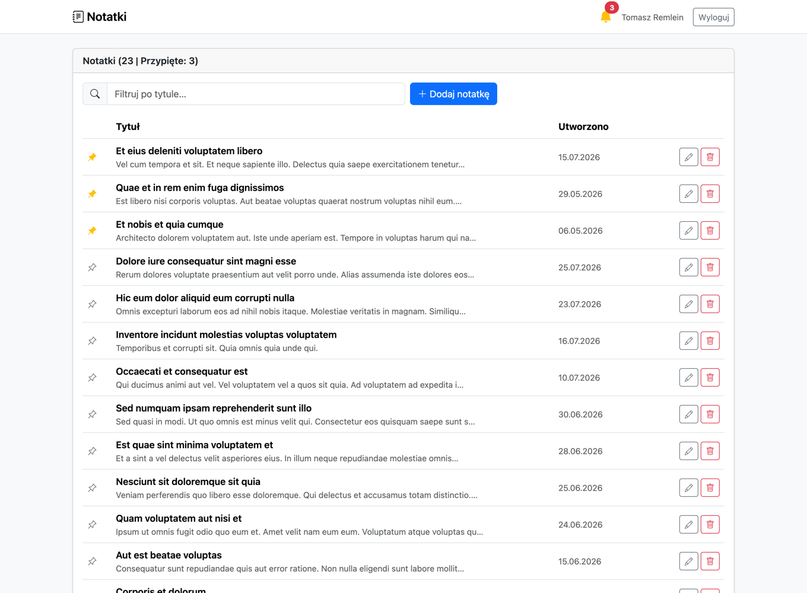
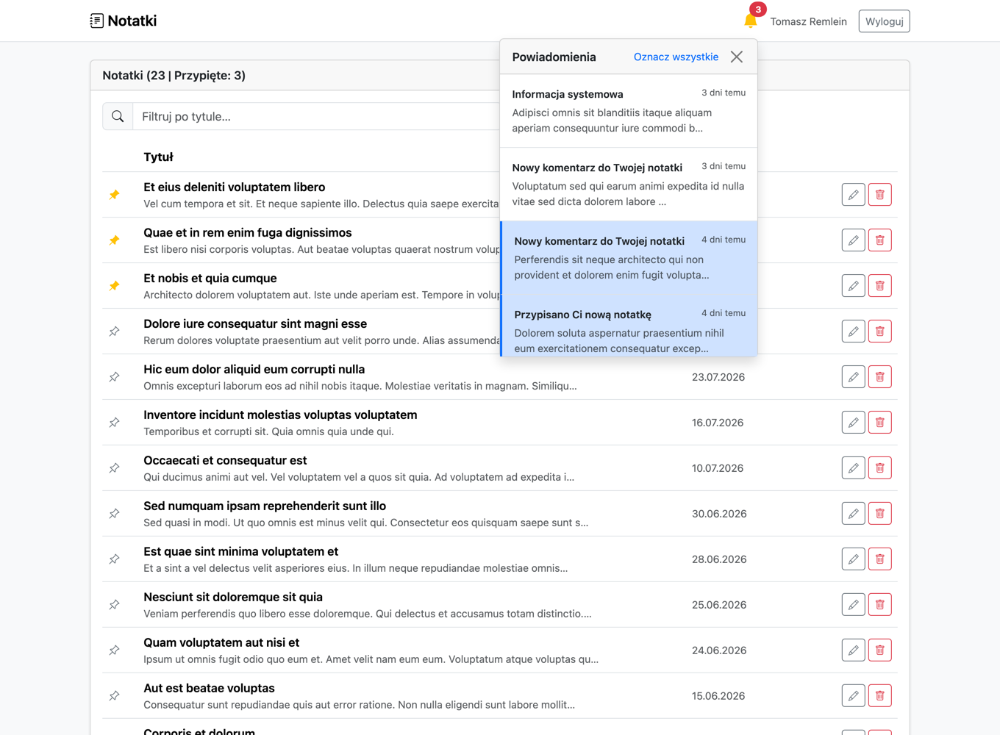
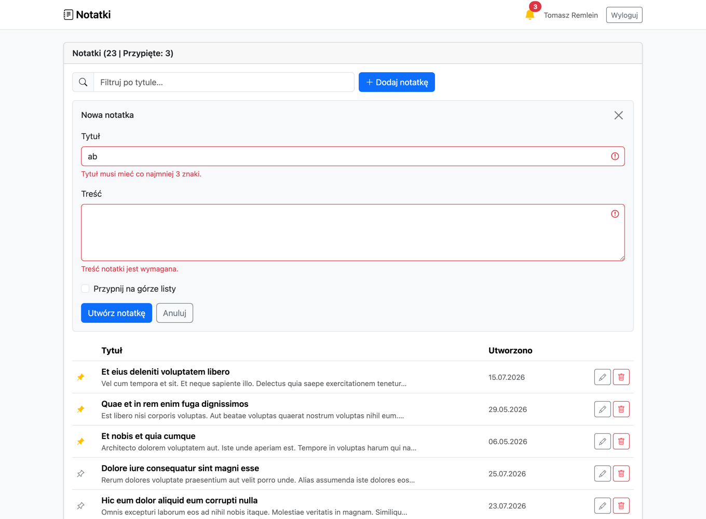

# Zadania rekrutacyjne - Full Stack Developer (Laravel / PHP / JS / Vue)

Rozwiązania wszystkich 5 zadań. Zadania 5a i 5b były opcjonalne, ale zrobiłem oba.

```
laravel-notes/          zadania 1, 2, 4, 5a, 5b - Laravel 13 + Vue 3 + Bootstrap 5
zadanie-3-task-queue/   zadanie 3 - czysty JS, bez zależności
```

Zadanie 3 jest osobnym pakietem, bo nie ma nic wspólnego z Laravelem. Reszta siedzi
w jednej aplikacji, bo zadanie 2 refaktoryzuje kod z zadania 1, a zadania 4 i 5 gadają
z tym samym API.

Każde zadanie to osobny commit. Warto zajrzeć w diff commita zadania 2 - w commicie
zadania 1 `NoteController` używa Eloquenta bezpośrednio, a zadanie 2 przenosi to do
repozytorium i serwisu. Każdy commit jest zielony na własnym stanie repo, bez kodu
z zadań późniejszych.

## Podgląd



Liczniki w nagłówku, przypięte na górze, filtr i paginacja.




Panel powiadomień z badge nieprzeczytanych i czasem względnym oraz komunikaty walidacji
z Laravela podstawione pod pola formularza.

## Uruchomienie

Potrzebne: PHP 8.4, Composer 2, Node 18+. Baza to SQLite, nie trzeba MySQL-a.

```bash
cd laravel-notes
composer install
cp .env.example .env
php artisan key:generate
touch database/database.sqlite
php artisan migrate --seed
npm install
npm run build              # albo npm run dev przy pracy nad frontem
php artisan serve          # http://127.0.0.1:8000
php artisan queue:work     # drugi terminal, potrzebne do zadania 5b
```

Logowanie: `tomek-remlein@wp.pl` / `password` (pola są wstępnie wypełnione). Drugie konto
`jan.kowalski@example.com` z tym samym hasłem służy do sprawdzenia izolacji danych - po
zalogowaniu widać zupełnie inne notatki.

Jeśli uruchamiasz serwer na innym porcie niż 8000, dopisz go do `SANCTUM_STATEFUL_DOMAINS`
w `.env`. Widget chodzi na sesyjnym trybie Sanctuma, który sprawdza domenę, więc bez tego
każde żądanie z widgetu skończy się kodem 401.

```bash
cd zadanie-3-task-queue
npm test          # 10 testów
npm run examples  # 3 przykłady użycia
```

## Testy

```bash
cd laravel-notes
php artisan test    # backend, 55 testow (211 asercji)
npm test            # front, 45 testow (Vitest + @vue/test-utils)

cd ../zadanie-3-task-queue
npm test            # 10 testow (node:test)
```

### Backend

| Plik | Co pokrywa |
| --- | --- |
| `tests/Feature/Api/NoteApiTest.php` | CRUD, izolacja danych, walidacja 422, paginacja, limit notatek, 401 bez logowania |
| `tests/Feature/Api/AuthTest.php` | rejestracja, logowanie, token, brak enumeracji kont, wylogowanie |
| `tests/Feature/Api/NotificationApiTest.php` | lista, licznik nieprzeczytanych, oznaczanie, izolacja |
| `tests/Feature/NoteCreatedNotificationTest.php` | zdarzenie, kolejkowany listener, Mailable |
| `tests/Feature/NotesPageTest.php` | strona z widgetem, logowanie sesyjne, dostęp do API po sesji |
| `tests/Unit/NoteServiceTest.php` | reguły biznesowe bez bazy, na atrapie repozytorium |
| `tests/Unit/NotePolicyTest.php` | polityka bezpośrednio i przez `Gate` |

Trzy testy wymagane w zadaniu 1 to `tworzy_notatke_dla_zalogowanego_uzytkownika`,
`zwraca_liste_wlasnych_notatek_z_paginacja_po_15` i
`proba_dostepu_do_cudzej_notatki_konczy_sie_404`.

### Front

| Plik | Co pokrywa |
| --- | --- |
| `resources/js/components/NoteManager.test.js` | filtrowanie przez computed bez zapytania do API, optymistyczny toggle i rollback, liczniki z `meta`, skeleton, stany puste, `confirm()` przy usuwaniu, polling co 3 minuty i czyszczenie interwału |
| `resources/js/components/NoteForm.test.js` | `watch` na propie `note`, mapowanie błędów 422 na pola, 422 bez `errors` jako komunikat ogólny, emity `saved` i `cancel` |
| `resources/js/components/NotificationBell.test.js` | licznik z `meta.unread_count`, optymistyczne oznaczanie z rollbackiem, rollback `read-all` po ID, polska odmiana czasu względnego, polling co 60 s |

Testy dzwonka są jednocześnie regresją na błąd znaleziony podczas przeglądu kodu: badge
liczył nieprzeczytane z długości listy, a lista ma maksymalnie 20 pozycji. Po przywróceniu
starej implementacji padają 4 testy.

## Zadanie 1 - API

| Metoda | Ścieżka | |
| --- | --- | --- |
| `POST` | `/api/register` | zwraca token, limit 6 żądań/min |
| `POST` | `/api/login` | zwraca token, limit 6 żądań/min |
| `POST` | `/api/logout` | unieważnia token użyty w żądaniu |
| `GET` | `/api/user` | dane zalogowanego |
| `GET` | `/api/notes` | 15 na stronę, `?page=`, `?per_page=` (max 50) |
| `POST` | `/api/notes` | 201 + nagłówek `Location` |
| `GET` | `/api/notes/{id}` | |
| `PUT`/`PATCH` | `/api/notes/{id}` | także aktualizacja częściowa |
| `DELETE` | `/api/notes/{id}` | 204 |

Odpowiedź listy:

```json
{
  "data": [ { "id": 31, "title": "…", "content": "…", "is_pinned": true,
              "created_at": "2026-07-23T12:38:38+00:00", "updated_at": "…" } ],
  "meta": { "current_page": 1, "per_page": 15, "last_page": 2, "total": 24,
            "pinned_total": 4, "from": 1, "to": 15, "path": "…", "links": [ … ] },
  "links": { "first": "…", "last": "…", "prev": null, "next": null }
}
```

`pinned_total` to globalny licznik przypiętych notatek użytkownika, nie tylko z bieżącej
strony. Bez tego liczniki w nagłówku widgetu byłyby błędne, gdy wyników jest więcej niż 15.

Kody: `422` walidacja albo reguła biznesowa, `401` brak sesji/tokenu, `404` notatka nie
istnieje **albo należy do kogoś innego**, `419` brak nagłówka CSRF w trybie sesyjnym.

**Cudza notatka daje 404, nie 403.** Repozytorium zawęża każde zapytanie do właściciela,
więc obcy zasób po prostu nie istnieje z punktu widzenia żądania. Nie potwierdzamy nawet
tego, że notatka o danym ID gdzieś jest. `NotePolicy` (`viewAny`, `view`, `create`,
`update`, `delete`) działa jako druga warstwa, na już wczytanym modelu, i ma osobne testy.

`user_id` nigdy nie pochodzi z ciała żądania - ustawia go serwis na podstawie
zalogowanego użytkownika. Jest na to test.

Sanctum działa tu w dwóch trybach i oba prowadzą do tych samych endpointów: token osobisty
dla klientów API (i testów) oraz sesja cookie dla widgetu na tym samym origin
(`statefulApi()` w `bootstrap/app.php`). W drugim trybie token nie leży w localStorage,
ciasteczko jest `HttpOnly`, a zapisy chroni CSRF.

## Zadanie 4 - widget Vue w Bladzie

To nie jest SPA. Laravel renderuje widoki, Vue montuje się w `#app` i przejmuje sam widget.

```
resources/js/app.js                     rejestracja komponentów, konfiguracja axios
resources/js/components/NoteManager.vue lista, liczniki, filtrowanie, polling, paginacja
resources/js/components/NoteForm.vue    formularz, obsługa 422
resources/views/notes.blade.php         <note-manager></note-manager>
resources/views/layouts/app.blade.php   #app, navbar z dzwonkiem
```

Dwie rzeczy warte odnotowania:

**Alias `vue` na build z kompilatorem szablonów** (`vite.config.js`). Domyślny import
`vue` w bundlerze to wersja runtime-only, która nie umie skompilować szablonu wziętego
z DOM. Skoro komponent osadzamy znacznikiem `<note-manager>` w Bladzie, ten kompilator
jest potrzebny. Bez aliasu `#app` renderuje się jako pusty `<!---->` i widget się nie
pojawia - bez żadnego błędu w konsoli.

**`withXSRFToken` to w axios 1.x osobna flaga.** Samo `withCredentials` nie wystarcza,
bez niej każdy `POST/PUT/PATCH/DELETE` z widgetu dostaje 419.

API zwraca 15 notatek na stronę, więc widget ma sterowanie stronami (szkielet z zadania
tego nie przewidywał, ale bez tego 9 z 24 notatek byłoby nie do zobaczenia). Filtrowanie
działa - zgodnie z wymaganiem - na już pobranej stronie, przez `computed`; stan pusty
mówi o tym wprost.

## Zadanie 5a - powiadomienia

| Metoda | Ścieżka | |
| --- | --- | --- |
| `GET` | `/api/notifications` | 20 najnowszych + `meta.unread_count` |
| `PATCH` | `/api/notifications/{id}/read` | idempotentne |
| `PATCH` | `/api/notifications/read-all` | zwraca liczbę zmienionych |

`read-all` jest zdefiniowane przed trasą z parametrem, inaczej „read-all" zostałoby
dopasowane jako `{notification}`.

Badge liczy się z `meta.unread_count`, a nie z długości listy - lista ma maksymalnie
20 pozycji, więc przy 25 nieprzeczytanych pokazywałaby 20. Optymistyczne oznaczanie
koryguje licznik lokalnie, żeby badge reagował od razu.

Czas względny liczę ręcznie, bo polskie formy liczby mnogiej są nieregularne
(1 minutę / 2 minuty / 5 minut), a `Intl.RelativeTimeFormat` nie zna formy dla 2-4.
`day.js` byłby zależnością dla jednej funkcji.

Model `Notification` nie korzysta z systemu notyfikacji Laravela, bo zadanie wymaga
jawnych kolumn `type`/`title`/`body`/`read_at`, a nie UUID i JSON-owego `data`. Dlatego
`User` nie używa traitu `Notifiable` - jego relacja `notifications()` gryzłaby się z naszą.

## Decyzje i ograniczenia

- Bootstrap zamiast Tailwinda ze szkieletu Laravela - zadanie wymaga bootstrapowego
  skeleton loadera i ikon `bi-bell`.
- `Model::preventLazyLoading()` poza produkcją, żeby N+1 wywalał błąd od razu.
- Notatki nie mają soft delete, `DELETE` usuwa trwale.
- Limit 100 notatek nie jest transakcyjny - szczegóły w
  [`docs/zadanie-2-refaktoryzacja.md`](laravel-notes/docs/zadanie-2-refaktoryzacja.md).
- Powiadomienia nie mają repozytorium: jedna tabela i trzy zapytania, więc kolejny
  interfejs byłby warstwą bez treści. Kontroler nadal nie dotyka modeli.
- Nie ma weryfikacji e-maila ani resetu hasła - poza zakresem zadań.
- `@vue/test-utils` ciągnie `js-beautify` z podatnym `brace-expansion`, więc w
  `package.json` jest `overrides` na wersję z łatką. Bez tego `npm audit` pokazuje
  6 podatności high w zależnościach deweloperskich.

## Dokumentacja szczegółowa

- [`docs/zadanie-2-refaktoryzacja.md`](laravel-notes/docs/zadanie-2-refaktoryzacja.md) - Repository + Service Layer, kod przed i po
- [`docs/zadanie-5b-dlaczego-shouldqueue.md`](laravel-notes/docs/zadanie-5b-dlaczego-shouldqueue.md) - dlaczego listener jest kolejkowany
- [`zadanie-3-task-queue/README.md`](zadanie-3-task-queue/README.md) - API i decyzje w kolejce zadań
